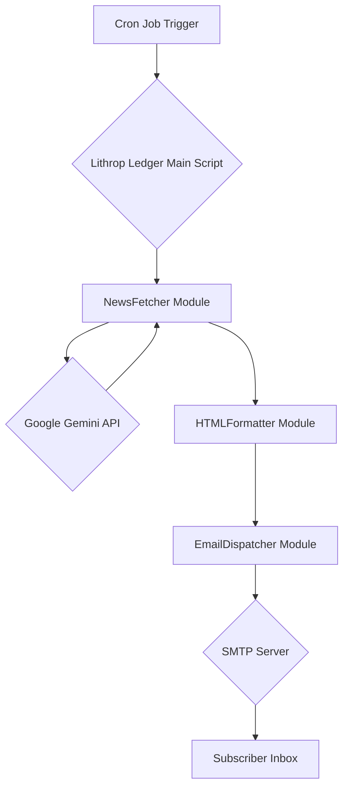

# Technical Design Document: Lithrop Ledger Automation

## 1. Introduction

This document outlines the technical design for the Lithrop Ledger Automation, a Python-based system designed to automatically generate and distribute a daily news newsletter. The system will leverage the Google Gemini 3.0 Pro model for content generation, format it into a professional HTML email, and deliver it to subscribers via SMTP.

## 2. System Architecture Diagram

A text-based flowchart illustrating the data pipeline from the Cron job trigger to the final email delivery.



## 3. Module Design

The application will be segmented into three primary Python modules, each with a distinct responsibility.

### 3.1. `NewsFetcher`

- **Responsibility:**
  - This module is responsible for all interactions with the Google Gemini API.
- **Functions:**
  - `__init__(self, api_key)`: Initializes the Gemini client with the provided API key.
  - `get_daily_news(self, prompt)`:
    - Sends a precisely engineered prompt to the `gemini-3.0-pro` model.
    - Implements a retry mechanism with exponential backoff to handle transient API errors.
    - Returns the raw news content, expected to be in Markdown format, upon a successful API response.

### 3.2. `HTMLFormatter`

- **Responsibility:**
  - This module transforms the raw Markdown from `NewsFetcher` into a polished HTML email with inline CSS.
- **Functions:**
  - `__init__(self, template_path)`: Loads a Jinja2 HTML template from the specified path.
  - `format_newsletter(self, news_data)`:
    - Parses the Markdown content into a structured Python object (e.g., a dictionary of news sections).
    - Renders the Jinja2 template, injecting the structured news content.
    - Utilizes the `premailer` library to convert all CSS `<style>` blocks and linked stylesheets into inline `style` attributes on each HTML element, ensuring maximum compatibility with email clients.
    - Returns the final, fully-formatted HTML string.

### 3.3. `EmailDispatcher`

- **Responsibility:**
  - This module handles the secure sending of the generated HTML newsletter via SMTP.
- **Functions:**
  - `__init__(self, smtp_host, smtp_port, username, password)`: Initializes the SMTP connection details.
  - `send_email(self, to_email, subject, html_content)`:
    - Establishes a secure connection to the SMTP server (e.g., `smtp.gmail.com:587`) using `smtplib`.
    - Authenticates using the provided credentials (specifically, a Gmail App Password).
    - Constructs a `MIMEMultipart` email message, setting the body to the provided HTML content and ensuring the `Content-Type` is `text/html`.
    - Sends the email to the specified recipient.

## 4. Data Flow

The end-to-end process is as follows:

1.  **Trigger:** At 08:00 PT on weekdays, the `cron` daemon on the Ubuntu server executes the main Python script.
2.  **Prompt Loading:** The script begins by reading the Gemini API prompt from the `prompt.md` file in the project root.
3.  **Configuration Loading:** The script loads environment variables from a `.env` file, securing the `GEMINI_API_KEY` and `EMAIL_APP_PASSWORD`.
4.  **News Fetching:** The `NewsFetcher` module is instantiated. The prompt content read from the file is passed to the `get_daily_news` method, which calls the Gemini API.
5.  **HTML Transformation:** The raw Markdown response is passed to the `HTMLFormatter`. It uses a Jinja2 template to structure the newsletter and then inlines all CSS to create a self-contained HTML document.
6.  **Email Dispatch:** The `EmailDispatcher` module connects to Gmail's SMTP server, authenticates, and sends the final HTML as the body of an email to the designated subscriber.
7.  **Logging:** The script logs the success or failure of the operation to a local log file for monitoring.


## 5. Security & Configuration

Security is paramount. All sensitive credentials will be managed using a `.env` file and the `python-dotenv` library.

-   **`.env` File Structure:** A file named `.env` will be placed in the project's root directory. It will **not** be committed to version control.

    ```
    GEMINI_API_KEY="your_gemini_api_key_here"
    EMAIL_APP_PASSWORD="your_gmail_app_password_here"
    SMTP_USERNAME="your_email@gmail.com"
    RECIPIENT_EMAIL="subscriber_email@example.com"
    ```

### 5.2. Prompt Configuration
To allow for easy modification of the news generation query without altering code, the prompt sent to the Gemini API will be stored in a dedicated file.

- **File:** `prompt.md`
- **Location:** Project root directory.
- **Content:** This file will contain the full, detailed prompt asking the AI to generate the newsletter. It will specify the desired sections (Market Data, Sports, etc.), tone, and Markdown formatting.

-   **Loading in Python:** The main script will be responsible for reading the content of this file into a string before passing it to the `NewsFetcher` module.

    ```python
    with open('prompt.md', 'r') as f:
        prompt_content = f.read()
    ```

-   **Loading in Python:** The main script will use `python-dotenv` to load these variables.

    ```python
    from dotenv import load_dotenv
    import os

    load_dotenv()

    gemini_key = os.getenv("GEMINI_API_KEY")
    app_password = os.getenv("EMAIL_APP_PASSWORD")
    ```

## 6. HTML/CSS Template Strategy

To achieve a professional and compatible newsletter format, we will use a combination of Jinja2 for templating and Premailer for CSS inlining.

-   **Template Engine:** `Jinja2` will be used to create a base HTML template (`newsletter_template.html`). This allows for dynamic content insertion and logical structuring (e.g., loops for news items) while keeping the HTML clean and readable.

-   **Styling Approach:**
    1.  All CSS will be written within a `<style>` tag in the head of the Jinja2 template.
    2.  The design will use tables for the main layout to ensure robust support across older email clients like Outlook.
    3.  Modern CSS will be used for styling elements like "cards," borders, and typography.

-   **CSS Inlining:** After rendering the template with the news content, the `premailer` Python library will process the HTML. It will automatically move all styles from the `<style>` block to inline `style="..."` attributes on the corresponding HTML elements. This is a critical step, as many email clients strip `<style>` tags.

## 7. Error Handling

The system will be designed to be resilient to common failures.

-   **API Failures (`NewsFetcher`):**
    -   A retry mechanism will be implemented for API calls.
    -   It will use an exponential backoff strategy: wait 2s, then 4s, then 8s, up to a maximum of 3 retries.
    -   If the API call fails after all retries, the script will log the detailed error and exit gracefully. An optional enhancement would be to send an admin alert email.
-   **SMTP Failures (`EmailDispatcher`):**
    -   SMTP connection or authentication errors will be caught in a `try...except` block.
    -   The error will be logged with a clear message indicating a delivery failure.
    -   The script will exit with a non-zero status code, which can be monitored by the cron system.

## 8. Scheduling with Cron

The script will be scheduled to run daily using a standard Linux `cron` job.

-   **Crontab Entry:** The following line will be added to the user's crontab (`crontab -e`):

    ```cron
    0 8 * * 1-5 /usr/bin/python3 /path/to/your/project/main.py >> /path/to/your/project/logs/cron.log 2>&1
    ```

-   **Explanation:**
    -   `0 8 * * 1-5`: Runs at 08:00 every day from Monday to Friday.
    -   `/usr/bin/python3`: Specifies the correct Python interpreter.
    -   `/path/to/your/project/main.py`: The absolute path to the main executable script.
    -   `>> ... 2>&1`: Appends both standard output and standard error to a log file for debugging.

## 9. Test Automation Script

To manually test the automation process and ensure all components are functioning correctly, a simple bash script can be executed on demand. This script will simulate the environment and execution of the cron job.

**`test_automation.sh`**

```bash
#!/bin/bash

# --- Configuration ---
# Set the path to your project directory
PROJECT_DIR="/path/to/your/project"
# Set the path to your main Python script
MAIN_SCRIPT="main.py"
# Set the path for the log file
LOG_FILE="${PROJECT_DIR}/logs/test_automation.log"
# Set the Python executable path
PYTHON_EXEC="/usr/bin/python3"

# Ensure the logs directory exists
mkdir -p "${PROJECT_DIR}/logs"

echo "--- Starting Lithrop Ledger Automation Test ---" | tee -a "${LOG_FILE}"
echo "Test initiated at: $(date)" | tee -a "${LOG_FILE}"
echo "Project directory: ${PROJECT_DIR}" | tee -a "${LOG_FILE}"

# Navigate to the project directory
cd "${PROJECT_DIR}" || { echo "Error: Could not change to project directory ${PROJECT_DIR}" | tee -a "${LOG_FILE}"; exit 1; }

# Execute the main Python script
echo "Executing Python script: ${PYTHON_EXEC} ${MAIN_SCRIPT}" | tee -a "${LOG_FILE}"
"${PYTHON_EXEC}" "${MAIN_SCRIPT}" >> "${LOG_FILE}" 2>&1
SCRIPT_EXIT_CODE=$?

if [ ${SCRIPT_EXIT_CODE} -eq 0 ]; then
    echo "Python script executed successfully." | tee -a "${LOG_FILE}"
    echo "Check your recipient email for the newsletter." | tee -a "${LOG_FILE}"
else
    echo "Error: Python script failed with exit code ${SCRIPT_EXIT_CODE}." | tee -a "${LOG_FILE}"
    echo "Review ${LOG_FILE} for details." | tee -a "${LOG_FILE}"
fi

echo "Test finished at: $(date)" | tee -a "${LOG_FILE}"
echo "--- Lithrop Ledger Automation Test Complete ---" | tee -a "${LOG_FILE}"

exit ${SCRIPT_EXIT_CODE}
```

**How to Use:**
1.  **Save:** Save the content above as `test_automation.sh` in your project's root directory.
2.  **Permissions:** Make the script executable: `chmod +x test_automation.sh`
3.  **Configure:** Edit `PROJECT_DIR`, `MAIN_SCRIPT`, and `PYTHON_EXEC` variables within the script to match your setup.
4.  **Run:** Execute the script from your terminal: `./test_automation.sh`
5.  **Verify:** Check the `test_automation.log` file in your project's `logs` directory for execution details and your email inbox for the newsletter.

